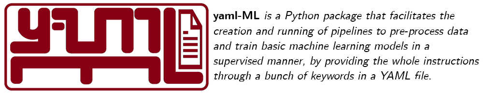

[//]: # (
)

[//]: # (  )

[//]: # (
)

  

  

_This is the official main repository for `yaml-ML` Python package._

___

  

___

# ⏩ Quickstart

## 1. Installation

TODO

## 2. Usage

TODO

## 3. Docs

TODO

# 📖 Usage Example: Step-by-Step

TODO